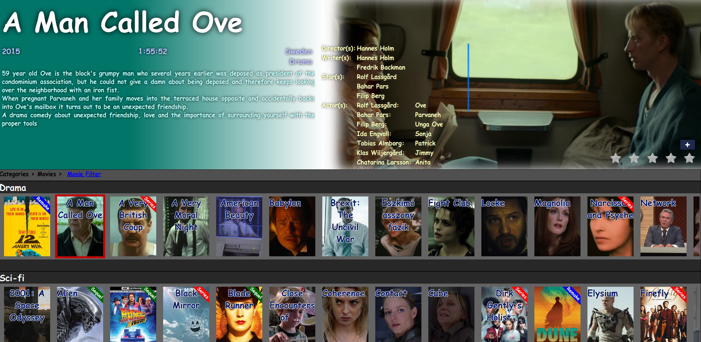

<h1>
  
  HOMEFLIX
</h1>

###  Your Personal Media Hub

Transform your local media collection into a Netflix-like streaming experience. HomeFlix is a self-hosted media player that brings your movies, TV shows, and videos to life with a sleek, user-friendly interface.

🎬 **Key Features:**
- Stream your media collection across your local network
- Organize content with flexible categorization (genres, actors, themes, etc.)
- Netflix-style browsing and navigation
- Custom media libraries with personalized structure
- Easy access from any device on your network
- Familiar streaming service experience with your own content

📚 **Supports Various Media Types:**
- Movies and TV shows
- YouTube downloads
- Documentation and E-books
- Music and music videos
- Personal photos and videos
- Educational content
- Any digital media you want to organize

🛠️ **Minimal Hardware Requirements:**
- Raspberry Pi 4 (as server)
- USB drive for media storage
- Local network connection

Perfect for anyone who wants to create their private streaming service using their personal media collection. Whether you're a movie enthusiast, educator, or just looking to organize your digital life, HomeFlix provides a centralized hub for all your media. No internet required - everything runs on your local network!

---

---

* [Raspberry Pi 4 preparation](wiki/preparation.md)
* [Database](wiki/database.md)
* [Solutions](wiki/solutions.md)

