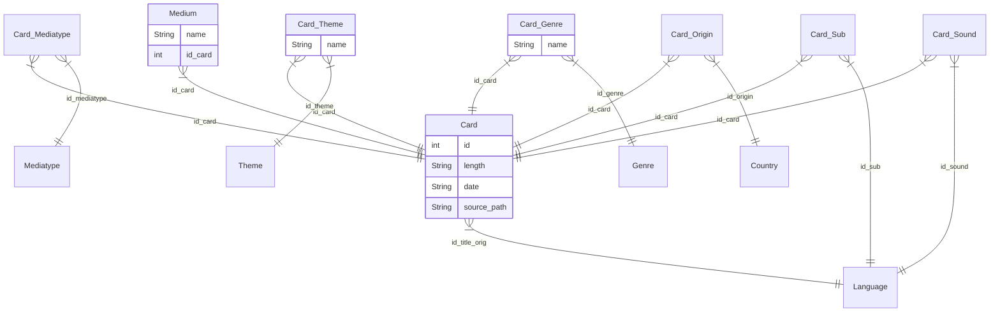

# playem
web media player

## Database 

```mermaid
erDiagram
    Card {
        int id
        String length
        String date
        String source_path
    }
    Card_Theme {
        String name
    }

    Card_Genre {
        String name
    }

    Medium {
        String name
        int id_card
    }

    Card_Mediatype many(1) to 1 Card : id_card
    Card_Mediatype many(1) to 1 Mediatype: id_mediatype

    Card_Theme many(1) to 1 Card : id_card
    Card_Theme many(1) to 1 Theme: id_theme

    Card_Genre }|--|| Card: id_card
    Card_Genre }|--|| Genre: id_genre

    Card_Origin }|--|| Card: id_card
    Card_Origin }|--|| Country: id_origin

    Medium }|--|| Card: id_card

    Card }|--|| Language: id_title_orig

    Card_Sub }|--|| Card: id_card
    Card_Sub }|--|| Language: id_sub

    Card_Sound }|--|| Card: id_card
    Card_Sound }|--|| Language: id_sound

```
