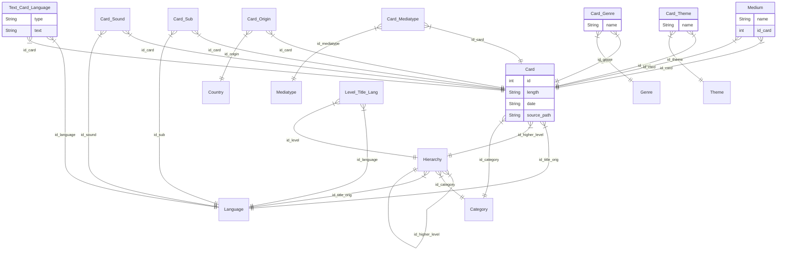

# HOMEFLIX
web media player

## Database 

```mermaid
erDiagram
    Card {
        int id
        String length
        String date
        String source_path
    }
    Card_Theme {
        String name
    }

    Card_Genre {
        String name
    }

    Medium {
        String name
        int id_card
    }

    Card_Mediatype many(1) to 1 Card : id_card
    Card_Mediatype many(1) to 1 Mediatype: id_mediatype

    Card_Theme many(1) to 1 Card : id_card
    Card_Theme many(1) to 1 Theme: id_theme

    Card_Genre many(1) to 1 Card: id_card
    Card_Genre many(1) to 1 Genre: id_genre

    Card_Origin many(1) to 1 Card: id_card
    Card_Origin many(1) to 1 Country: id_origin

    Medium many(1) to 1 Card: id_card

    Card many(1) to 1 Language: id_title_orig

    Card_Sub many(1) to 1 Card: id_card
    Card_Sub many(1) to 1 Language: id_sub

    Card_Sound many(1) to 1 Card: id_card
    Card_Sound many(1) to 1 Language: id_sound

    Text_Card_Language many(1) to 1 Language : id_language
    Text_Card_Language many(1) to 1 Card : id_card

    Text_Card_Language{
        String type
        String text
    }

    Card many(1) to 1 Hierarchy : id_higher_level
    Card many(1) to 1 Category : id_category
    Hierarchy many(1) to 1 Hierarchy : id_higher_level
    Hierarchy many(1) to 1 Category : id_category
    Hierarchy many(1) to 1 Language : id_title_orig
    Level_Title_Lang many(1) to 1 Language : id_language
    Level_Title_Lang Many(1) to 1 Hierarchy : id_level

    Medium many(1) to 1 Card : id_card
    
```
